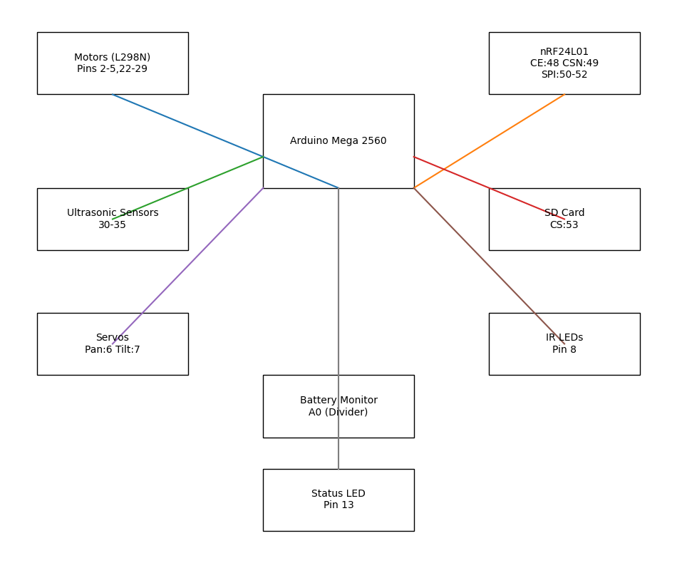

# Surveillance Rover (Tracked Recon Platform)

## Demo / Preview

## Overview
This is a custom-built tracked surveillance rover designed to navigate tight or hazardous environments where it’s not safe (or practical) to send a person.

Instead of wheels, it uses dual caterpillar tracks for better stability and traction, especially in uneven terrain or confined spaces.

The focus of this project was building something reliable in real-world conditions—handling signal loss, obstacles, and battery safety while staying easy to control remotely.

---

## What it can do
- Drive using dual caterpillar tracks (better grip and stability than wheels)
- Controlled wirelessly using nRF24L01 (long-range communication)
- Detect obstacles in real-time with ultrasonic sensors
- Pan/tilt camera system for better visibility while moving
- IR lighting for low-light / night operation
- Monitor battery voltage and prevent unsafe discharge
- Send telemetry back to the controller
- Log data to an SD card for post-run analysis

---

## System Architecture

---

## Hardware Used
- Arduino Mega 2560
- nRF24L01 (PA + LNA module for extended range)
- L298N motor drivers (dual)
- HC-SR04 ultrasonic sensors
- Servo motors (camera pan/tilt)
- 5200mAh LiPo battery
- SD card module
- Dual caterpillar track chassis

---

## Firmware
Main control logic lives here:
